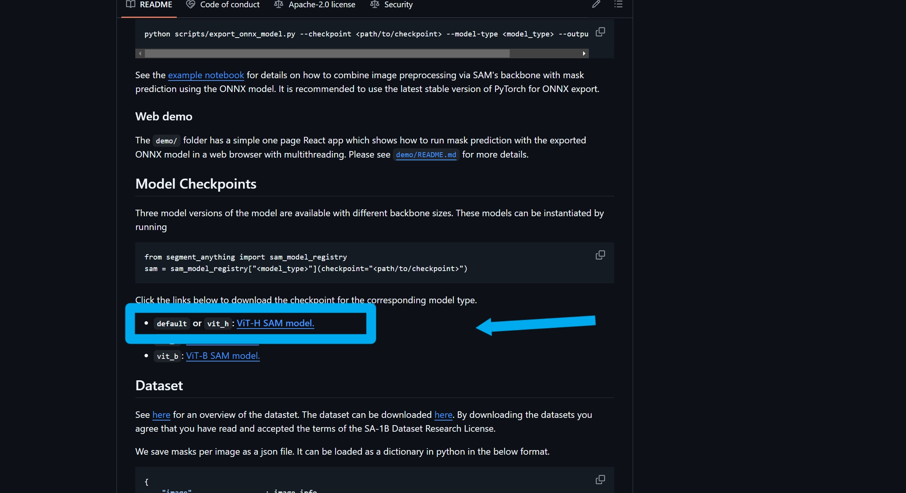

# 🛠️ MM-SemanticSeg-Labeler


>  🤖  **自动方法搞不定？那就亲自上阵！**  

本项目提供了一款多模态**语义分割**数据标注工具，旨在提升标注效率与精准度。该工具通过可视化呈现图像和文字标注，帮助用户直观地进行分割掩码标注。用户可以轻松点击图像进行正负样本标注，并实时编辑或添加文本标注。
## ✨ 功能特点

- ✅ **支持交互式点选分割**
- ✅ **分类保存示例图的Overlay和Binary与无法标注图像**
- ✅ **支持编辑并自动保存 Question / Answer 到原 JSON**


## 🔧 配置说明

所有配置项，包括模型路径、数据路径、输出目录以及应用设置，都已集中到 `config.py` 文件中。

```python
# config.py 示例
SAM_CHECKPOINT = "sam_vit_h_4b8939.pth"  # SAM 模型权重文件路径
MODEL_TYPE = "vit_h"                     # SAM 模型类型

JSON_PATH = "D:/dataset/test_images/grasp_test_annotation.json"  # JSON 标注文件路径
IMAGE_ROOT = "D:/dataset/test_images"                             # 原始图像所在目录

RESULTS_DIR = "results"             # 分割结果保存目录
GOOD_EXAMPLES_DIR = "good_examples" # 优秀示例保存目录
BAD_EXAMPLES_DIR = "bad_examples"   # 无法标注示例保存目录

POINT_HISTORY_LIMIT = 100 # 撤销/重做历史记录的最大步数

SERVER_NAME = "127.0.0.1" # Gradio 服务监听地址
SERVER_PORT = 7861        # Gradio 服务监听端口

```

`IMAGE_ROOT` 下可以有多个子文件夹。只要 JSON 中 `"image"` 字段的路径和 `IMAGE_ROOT` 对齐，即可正常工作。

## 🧠 模型说明

本工具使用的是 Meta AI 发布的 [SAM](https://github.com/facebookresearch/segment-anything) 模型，确保你下载了权重并放置在配置位置：

```python
SAM_CHECKPOINT = "sam_vit_h_4b8939.pth"
MODEL_TYPE = "vit_h"
```



## 📁 数据格式说明

`grasp_test_annotation.json` 文件应遵循**每行一个 JSON 对象**的格式，字段说明如下：
- `"image"` 图片的相对路径
- `”question"` 对图片的描述或提问 
- `Answer` 对应问题的文本答案 

注：`question`和`Answer` **可以为 None**

- 若 question 或 answer 字段缺失，系统会自动补全为 None
- 用户在标注界面中编辑后，内容将自动写回原始 JSON 文件（覆盖对应行）

示例：

```json
{"image": "car/0001.jpg", "question": "图中是什么目标？", "answer": "左边的车"}
{"image": "airplane/0001.jpg", "question": "图中是什么目标？", "answer": "右边的飞机"}
```
示例中`car`, `airplane`均为test_images下的子文件夹


## 🚀 启动方式

### 启动标注工具

```bash
python sam_annotation_tool.py
```

默认会启动本地服务在 `http://127.0.0.1:7861`，打开浏览器访问即可开始标注。


## 🖱️ 使用方式

### ✅ 添加标注点

- 左侧点击图像添加正（绿色圆点）或负样本点（红色叉）
- 可撤销 / 重做（支持多步）

### 📷 导航图像

- 使用左右按钮或进度条跳转图片
- 当前图像编号会显示在下方

### 📝 编辑 Q&A

- 右侧支持直接编辑该图片对应的 **Question** 和 **Answer**
- 每次修改会自动保存到原始 JSON 文件中

### 💾 保存方式

| 功能                       | 说明                                      | 保存路径         |
|--------------------------|-------------------------------------------|------------------|
| 保存数据标注                   | 保存 mask.png 和 overlay.png             | `results/`       |
| 保存你希望留下来在论文、汇报等中用作案例的好样本 | 保存原图 + 掩码 + 叠加图 + JSON           | `good_examples/` |
| 保存无法标注的坏样本               | 保存原图 + JSON + 备注文本（可选）        | `bad_examples/`  |


